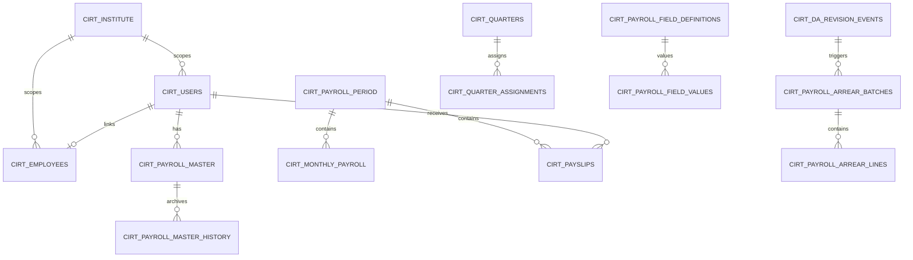

# CIRT Payroll — Technical Architecture

**Application:** CIRT Payroll  
**Organization:** Central Institute of Road Transport (CIRT) — single-organization deployment  
**Document purpose:** Client-facing technical architecture for review and submission  
**Last updated:** July 2026

---

## 1. Executive summary

CIRT Payroll is a **single-organization** payroll management system built exclusively for CIRT. It does not support public self-registration, multi-company switching, or SaaS-style tenant onboarding. All users and payroll data are scoped internally to one fixed CIRT organization context.

The solution uses a **modern three-tier architecture**:

| Layer | Technology | Responsibility |
|-------|------------|----------------|
| Presentation | **Next.js** (React) | Web UI, client routing, print/export views, API proxy to backend |
| Application | **Laravel API** | Business logic, payroll calculations, RBAC, import/export, auth |
| Data | **PostgreSQL** | Persistent storage for employees, payroll master, runs, payslips, settings |

Reports and payslips are **generated and exported on demand** (screen, PDF, Excel). The system does **not** require a separate NAS or document-management store for routine payroll operations.

---

## 2. High-level system architecture

### 2.1 Logical view

```
┌─────────────────────────────────────────────────────────────────────────┐
│                         End users (Browser)                              │
│              Admin users  │  Employee self-service users                 │
└────────────────────────────────┬────────────────────────────────────────┘
                                 │ HTTPS (SSL recommended)
                                 ▼
┌─────────────────────────────────────────────────────────────────────────┐
│                    Windows Server 2019/2022 + IIS                        │
│  ┌──────────────────────────┐    ┌──────────────────────────────────┐ │
│  │   Next.js frontend       │    │   Laravel API (PHP)               │ │
│  │   • App pages & UI       │───▶│   • REST API /api/v1/*            │ │
│  │   • /api/* route proxy   │    │   • Payroll engine & RBAC         │ │
│  │   • Payslip print/export │    │   • Sanctum token validation        │ │
│  └──────────────────────────┘    └───────────────┬──────────────────┘ │
└──────────────────────────────────────────────────┼────────────────────┘
                                                   │ SQL (TCP)
                                                   ▼
                              ┌────────────────────────────────────────┐
                              │           PostgreSQL database           │
                              │  Payroll master, monthly runs, slips,  │
                              │  employees, settings, quarters, history │
                              └────────────────────────────────────────┘
```

### 2.2 Request flow (typical)

```
Browser → IIS → Next.js page or /api proxy → Laravel /api/v1 → PostgreSQL
                ↑
         Session cookie + API token (httpOnly)
```

1. User opens the web application in a browser.
2. **IIS** terminates TLS (recommended) and routes traffic to the Next.js host.
3. Authenticated UI calls go through Next.js **API routes**, which forward requests to the Laravel backend with the user’s bearer token.
4. Laravel validates the session, applies **role-based access**, resolves the fixed **CIRT organization context**, executes business logic, and reads/writes PostgreSQL.
5. Responses return as JSON (or binary for Excel export) to the browser.

### 2.3 Key architectural principles

- **Single organization:** One CIRT institute profile internally (`cirt_institute`, legacy name `cirt_companies`). `company_id` remains on tables for relational integrity but is **not exposed** in the UI or exports.
- **No public signup:** Accounts are provisioned by administrators only.
- **Separation of concerns:** UI in Next.js; rules, calculations, and data integrity in Laravel.
- **On-demand documents:** Payslips and payroll reports are rendered or exported at runtime—not archived as files on network storage by default.

---

## 3. Deployment architecture (Windows Server + IIS)

### 3.1 Deployment diagram

```
                    [ Internet / CIRT LAN ]
                              │
                              ▼
                    ┌─────────────────┐
                    │  Firewall / VPN  │
                    └────────┬────────┘
                             │ 443 HTTPS (SSL certificate)
                             ▼
┌────────────────────────────────────────────────────────────────┐
│              Windows Server 2019 / 2022                         │
│                                                                 │
│  ┌─────────────────────────────────────────────────────────┐   │
│  │  IIS (Web Server)                                        │   │
│  │  • Site binding: HTTPS                                   │   │
│  │  • URL Rewrite / ARR reverse proxy (optional)            │   │
│  │  • Hosts Next.js (Node/iisnode or reverse proxy to Node)  │   │
│  │  • Hosts or proxies Laravel (PHP via FastCGI / proxy)    │   │
│  └─────────────────────────────────────────────────────────┘   │
│         │                              │                        │
│         ▼                              ▼                        │
│  ┌──────────────┐              ┌──────────────────┐            │
│  │  Next.js app │              │  Laravel API      │            │
│  │  (port/site) │─────────────▶│  (PHP-FPM/CGI)    │            │
│  └──────────────┘   internal   └────────┬─────────┘            │
│                                         │                       │
│  ┌──────────────────────────────────────┼──────────────────┐   │
│  │  Local / attached storage             │                  │   │
│  │  • App logs, temp upload buffers      │                  │   │
│  │  • No mandatory NAS for payslip PDFs   │                  │   │
│  └──────────────────────────────────────┼──────────────────┘   │
└─────────────────────────────────────────┼────────────────────────┘
                                          │ 5432 (restricted)
                                          ▼
                               ┌─────────────────────┐
                               │  PostgreSQL Server   │
                               │  (same or separate   │
                               │   Windows/Linux VM)  │
                               └─────────────────────┘
```

### 3.2 Component roles on Windows Server

| Component | Role |
|-----------|------|
| **IIS** | Public entry point; HTTPS termination; static assets; reverse proxy to Node/PHP workers |
| **Next.js** | Serves React UI; proxies `/api/*` to Laravel; handles payslip print layouts client-side |
| **Laravel** | Stateless API; Sanctum authentication; payroll computation; import validation |
| **PostgreSQL** | Authoritative data store for all payroll and master data |
| **SSL/TLS** | **Strongly recommended** — payroll data (salary, bank, PAN, Aadhaar) is highly sensitive |

### 3.3 Deployment flow

1. Install **IIS**, URL Rewrite, and (if used) Application Request Routing.
2. Deploy **PostgreSQL** with restricted network access (app server only).
3. Deploy **Laravel** (`backend/`), configure `.env` (DB, `APP_URL`, CORS, Sanctum domains).
4. Run database migrations and seed default CIRT institute row.
5. Deploy **Next.js** (`frontend` / root app), configure API base URL to Laravel.
6. Bind IIS site to **HTTPS** with an organizational certificate.
7. Smoke-test: login, payroll master list, run payroll preview, payslip export.

---

## 4. Module-wise architecture

### 4.1 Module map

```
┌─────────────────────────────────────────────────────────────────────────┐
│                         CIRT Payroll Application                         │
├─────────────────┬─────────────────┬─────────────────┬───────────────────┤
│  Login / Auth     │  Admin area     │  Employee area  │  Shared services  │
├─────────────────┼─────────────────┼─────────────────┼───────────────────┤
│ • Email/password  │ • Payroll Master│ • Dashboard     │ • Institute       │
│ • Sanctum token   │ • Run Payroll   │ • My payslips   │   settings (CIRT) │
│ • Session cookie  │ • Salary slips  │ • Payroll hist. │ • Org structure   │
│ • No public signup│ • Settings      │ • Profile       │ • Import/export   │
│                 │ • Import/export │                 │ • RBAC middleware │
└─────────────────┴─────────────────┴─────────────────┴───────────────────┘
```

### 4.2 Module reference

| Module | Primary users | Backend area | Key data |
|--------|---------------|--------------|----------|
| **Login / Auth** | All | `AuthController`, Sanctum | `cirt_users` |
| **Admin dashboard** | Admin | Aggregated reads | Payroll periods, master |
| **Payroll Master** | Admin | `PayrollMasterController` | `cirt_payroll_master`, history |
| **Run Payroll** | Admin | `PayrollController` | `cirt_monthly_payroll`, periods |
| **Salary Slips** | Admin, Employee | `PayslipController` | `cirt_payslips`, monthly payroll |
| **Employee dashboard** | Employee | `UserController`, payslip APIs | Employee + latest payroll |
| **Payroll history** | Employee | Payslip/history APIs | `cirt_monthly_payroll`, slips |
| **Settings** | Admin | Company, org, fields, quarters | Institute + config tables |
| **Roles** | Admin | `RoleController` | `cirt_roles` |
| **Departments / Divisions / Designations** | Admin | Division/Dept/Designation controllers | Org structure tables |
| **Payroll fields** | Admin | `PayrollFieldController` | Field defs + values |
| **Salary increment** | Admin | `SalaryIncrementController` | `cirt_salary_increments` |
| **Quarters / accommodation** | Admin | `QuarterController` | `cirt_quarters`, assignments |
| **Import / Export** | Admin | `PayrollMasterService`, export routes | Master + run data |
| **Reports** | Admin | On-demand Excel/PDF generation | Computed from DB rows |

### 4.3 Frontend ↔ Backend layering

```
Next.js Page/Component
        │
        ▼
Next.js API Route  (/api/...)
        │  adds Authorization: Bearer <token>
        ▼
Laravel Controller  (Api/V1/*)
        │
        ├── Middleware: auth:sanctum, hrms.session, cirt.company
        ├── Service layer (PayrollMasterService, PayrollArrearService, …)
        └── Eloquent models → PostgreSQL
```

---

## 5. Database entity relationship overview

PostgreSQL stores all payroll, employee, configuration, and history data. The diagram below shows **key relationships only** (not every column).

### 5.1 Core identity & organization

```
cirt_institute (1 row: CIRT)          [internal; fixed org profile]
        │
        │ company_id (internal FK on child tables)
        ▼
┌───────────────┐     ┌────────────────┐     ┌─────────────────┐
│  cirt_users   │────▶│ cirt_employees │     │   cirt_roles    │
│  (login acct) │     │ (HR record)    │     │  (role catalog) │
└───────┬───────┘     └────────┬───────┘     └─────────────────┘
        │                      │
        │                      ├── cirt_divisions
        │                      ├── cirt_departments
        │                      └── cirt_designations
        │
        └── cirt_employee_bank_accounts (history)
```

> **Note:** The institute table is stored as `cirt_institute` (renamed from legacy `cirt_companies`). It holds address, PT, DA/HRA defaults, and logo URL. Users never select or switch organizations.

### 5.2 Payroll master & revisions

```
cirt_users ──────────────────────────────────────────────┐
                                                          │
cirt_payroll_master ◀── (employee_user_id)               │
        │                                                 │
        │ revision / archive                              │
        ▼                                                 │
cirt_payroll_master_history                               │
        │                                                 │
        ├── cirt_payroll_field_values ──▶ cirt_payroll_field_definitions
        │                                                 │
        └── cirt_salary_increments (effective-dated)     │
```

### 5.3 Monthly payroll run & payslips

```
cirt_payroll_periods (month / lock state)
        │
        ├── cirt_monthly_payroll (per-employee run rows, earnings/deductions)
        │         │
        │         └── used for Run Payroll preview & persistence
        │
        └── cirt_payslips (generated slip snapshots per period)
```

### 5.4 DA arrears & quarters

```
cirt_da_revision_events
        │
        ├── cirt_payroll_arrear_batches
        │         │
        │         └── cirt_payroll_arrear_lines
        │
cirt_quarters ◀── cirt_quarter_assignments ──▶ cirt_users / employees
```

### 5.5 Configuration

```
cirt_payroll_calculation_settings  (CPF %, basis fields)
cirt_payroll_field_definitions     (custom earnings/deductions)
cirt_institute                     (PT, DA/HRA institute defaults)
```

### 5.6 ERD (Mermaid — key entities only)



---

## 6. Security architecture

### 6.1 Security layers

```
┌──────────────────────────────────────────────────────────────┐
│ Layer 1: Transport        HTTPS / TLS on IIS (recommended)    │
├──────────────────────────────────────────────────────────────┤
│ Layer 2: Authentication   Laravel Sanctum API tokens          │
│                           httpOnly session cookie (UI)        │
│                           Login rate limiting                 │
├──────────────────────────────────────────────────────────────┤
│ Layer 3: Authorization    Admin vs Employee roles             │
│                           Managerial middleware (admin APIs)  │
│                           CompanyAccess (self vs admin view)  │
├──────────────────────────────────────────────────────────────┤
│ Layer 4: Data scope       Fixed CIRT org (cirt.company)       │
│                           Ignore tampered company_id payloads │
├──────────────────────────────────────────────────────────────┤
│ Layer 5: Application      Sensitive field masking (PAN, etc.) │
│                           Import file validation              │
│                           Formula-injection sanitization      │
└──────────────────────────────────────────────────────────────┘
```

### 6.2 Authentication flow

```
[User] ──email/password──▶ [POST /api/v1/auth/login]
                                │
                                ▼
                    Laravel validates credentials
                    Attaches user to CIRT institute
                    Issues Sanctum personal access token
                                │
                                ▼
              Next.js stores token in httpOnly cookie
              Session cookie holds user profile snapshot
                                │
                                ▼
         Subsequent requests: Bearer token + session version check
```

- **Public signup is disabled** (`DISABLE_PUBLIC_SIGNUP=true`).
- **Session invalidation** on password change / auth session version bump.
- **Employees** can only access their own payroll, payslips, and profile unless granted admin role.

### 6.3 Role matrix (simplified)

| Capability | Admin | Employee |
|------------|:-----:|:--------:|
| Payroll Master CRUD | ✓ | — |
| Run Payroll | ✓ | — |
| All employee payslips | ✓ | — |
| Own payslips / history | ✓ | ✓ |
| Settings / org structure | ✓ | — |
| Import / export | ✓ | — |
| Own profile (read/update) | ✓ | ✓ (limited) |

---

## 7. Import / export flow

### 7.1 Payroll Master import

```
Admin uploads Excel/CSV
        │
        ▼
Next.js /api/payroll/master/import  ──▶  Laravel PayrollMasterService
        │                                      │
        │                                      ├─ Validate template columns
        │                                      ├─ Sanitize cells (formula injection)
        │                                      ├─ Assign default CIRT company_id
        │                                      └─ Create/update users + master rows
        ▼
JSON result: success count, row errors, blocked rows
```

- **No Company ID column** required in template; all rows belong to CIRT automatically.
- Invalid templates are rejected with explicit error messages.

### 7.2 Export (Payroll Master / Run Payroll)

```
Admin selects export (Excel)
        │
        ▼
Laravel builds spreadsheet from DB
        │
        ├─ Filters by division/department (Run Payroll)
        ├─ Omits internal company_id from export
        └─ Streams .xlsx to browser
        │
        ▼
User downloads file (no server-side archival required)
```

---

## 8. Payslip / report generation flow

Payslips and reports are **computed on demand** from database rows—no separate document repository is required.

```
┌─────────────────┐
│ Select period / │
│ employee        │
└────────┬────────┘
         ▼
┌─────────────────────────────────────────┐
│ Laravel: load monthly_payroll + master  │
│          + institute header (CIRT)      │
│          + custom field values          │
│          + quarter / arrear adjustments │
└────────┬────────────────────────────────┘
         ▼
    ┌────┴────┐
    ▼         ▼
[Screen]   [Print/PDF]
 preview    browser print
    │         or
    ▼         Excel export
 Persist     (temporary download)
 optional
 snapshot
 in cirt_payslips
```

**Storage model:** Authoritative data lives in `cirt_monthly_payroll` and `cirt_payslips`. PDF/Excel files are generated at request time and delivered to the browser; they are not written to NAS unless an organization later chooses optional archival.

---

## 9. Employee self-service flow

```
Employee login
      │
      ▼
Role = Employee  ──▶  Redirect to Employee Dashboard
      │
      ├── Dashboard: latest payroll summary, quick links
      ├── My Salary Slips: filter by period, view/print
      ├── Payroll History: past monthly runs
      └── Profile: read-only or limited self-update (non-admin fields)
      │
      ▼
API enforces CompanyAccess:
  • Same CIRT org only
  • employee_user_id must match logged-in user
  • Sensitive fields masked where applicable
```

---

## 10. Admin payroll processing flow

```
┌──────────────────────────────────────────────────────────────────┐
│                    ADMIN PAYROLL LIFECYCLE                        │
└──────────────────────────────────────────────────────────────────┘

1. SETTINGS SETUP
   Divisions → Departments → Designations → Roles
   Institute profile (PT, DA/HRA) → Payroll fields → Quarters

2. PAYROLL MASTER
   Add / import employees
   Define salary structure (Basic, DA, HRA, CPF, custom fields)
   Revision history tracked in cirt_payroll_master_history

3. SALARY INCREMENT (optional)
   Effective-dated increments applied to master

4. RUN PAYROLL
   Select period (year/month)
   Filter by division/department
   Enter run-time adjustments (days, HPL, EOL)
   Preview calculations → persist cirt_monthly_payroll
   DA arrears applied when applicable

5. SALARY SLIPS & REPORTS
   Generate/view slips per employee or bulk
   Export run payroll Excel for audit

6. LOCK / AUDIT
   Payroll period lock prevents duplicate runs
   History tables retain revisions and arrear lineage
```

### 10.1 Processing diagram

```
Settings ──▶ Payroll Master ──▶ Run Payroll ──▶ Payslips / Export
   │              │                    │
   │              │                    └── cirt_monthly_payroll
   │              └── cirt_payroll_master (+ history)
   └── cirt_institute, org tables, field defs, quarters
```

---

## 11. Key components summary

| Component | Technology | Description |
|-----------|------------|-------------|
| Web UI | Next.js 14+ (App Router) | Admin and employee interfaces |
| API gateway (BFF) | Next.js `/api/*` routes | Proxies to Laravel with auth headers |
| REST API | Laravel 11 | `/api/v1/*` JSON API |
| Auth | Laravel Sanctum | Token-based API auth + cookies |
| ORM | Eloquent | PostgreSQL access |
| Payroll engine | PHP services | Government payroll rules, DA/HRA, HPL/EOL, arrears |
| Database | PostgreSQL | All transactional payroll data |
| Web server | IIS on Windows Server | Hosting and HTTPS |
| Document output | Browser print / Excel stream | On-demand; no NAS dependency |

---

## 12. Non-functional considerations

| Topic | Approach |
|-------|----------|
| **Availability** | IIS app pool recycling; DB backups; single-org simplifies scaling |
| **Backup** | Regular PostgreSQL backups (payroll + master + history) |
| **Sensitive data** | SSL in transit; masked PAN/Aadhaar in API responses; RBAC |
| **Auditability** | Payroll master history, arrear batches/lines, bank account history |
| **Compliance** | Access logging recommended at IIS/reverse-proxy level |

---

## 13. Glossary

| Term | Meaning |
|------|---------|
| **CIRT** | Central Institute of Road Transport — sole organization |
| **Payroll Master** | Employee salary structure template (effective-dated) |
| **Run Payroll** | Monthly payroll calculation and persistence |
| **Institute** | Internal `cirt_institute` row — org profile, not a selectable company |
| **company_id** | Internal database scoping column; always CIRT; hidden from users |

---

*This document describes the intended production architecture for CIRT Payroll. Implementation details may evolve; database table names reflect the current schema (`cirt_institute` for the fixed organization profile).*
