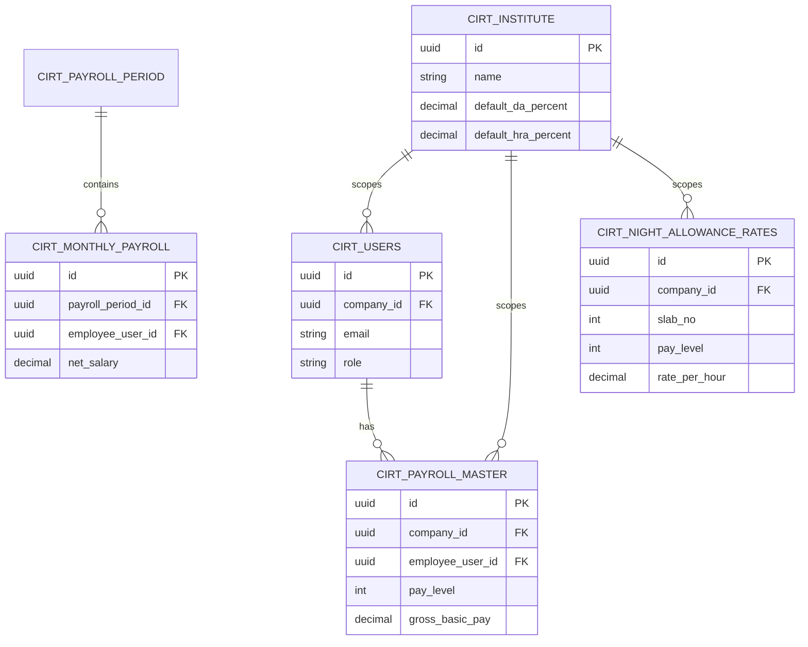

# CIRT Payroll — Database Architecture

**Companion to:** [CIRT_PAYROLL_TECHNICAL_ARCHITECTURE.md](./CIRT_PAYROLL_TECHNICAL_ARCHITECTURE.md)  
**Database:** PostgreSQL  
**Last updated:** July 2026 (performance indexes, monthly unique constraint, HPL/EOL snapshot columns)

This document describes the **physical database design** for CIRT Payroll: tables, relationships, snapshot rules, indexes, and column reference. All business tables are scoped by internal `company_id` referencing `cirt_institute.id`.

**Authoritative schema path:** Laravel migrations under `backend/database/migrations/` plus SQL mirrors in `database/sql/`. Legacy `supabase/` / `HRMS_*` scripts may exist but are not the current naming source of truth.

---

## 1. Schema overview

---

## 2. Institute and identity

### 2.1 `cirt_institute`

| Attribute | Detail |
|-----------|--------|
| **Purpose** | Fixed CIRT organization profile (renamed from `cirt_companies`) |
| **Module** | Settings → Institute Profile |
| **PK** | `id` (UUID) |
| **Typical rows** | One row for CIRT |

| Important columns | Description |
|-------------------|-------------|
| `name`, `address`, `logo_url` | Institute branding |
| `default_da_percent`, `default_hra_percent` | Institute DA/HRA defaults |
| `professional_tax` | Default PT |
| `created_at`, `updated_at` | Audit |

**Relationships:** Parent of all `company_id` FKs (logical institute scoping).

---

### 2.2 `cirt_users`

| Attribute | Detail |
|-----------|--------|
| **Purpose** | Login accounts (admin and employee) |
| **Module** | Auth, Payroll Master |
| **PK** | `id` (UUID) |
| **FK** | `company_id` → `cirt_institute.id` |

| Important columns | Description |
|-------------------|-------------|
| `email`, `password` | Credentials |
| `role` | Admin / employee / manager |
| `employee_code` | Links to payroll identity |
| `government_pay_level` | Synced from payroll master |
| `auth_session_version` | Session invalidation on password change |

---

### 2.3 `cirt_roles`

| Attribute | Detail |
|-----------|--------|
| **Purpose** | Role catalog for RBAC |
| **Module** | Settings → Roles |
| **PK** | `id` (UUID) |

---

### 2.4 `cirt_employees`

| Attribute | Detail |
|-----------|--------|
| **Purpose** | HR employee records |
| **Module** | Employees |
| **PK** | `id` (UUID) |
| **FK** | `company_id`, optional link to `cirt_users` |

---

### 2.5 `cirt_employee_bank_accounts`

| Attribute | Detail |
|-----------|--------|
| **Purpose** | Bank account change history |
| **Module** | Payroll Master |
| **PK** | `id` (UUID) |
| **FK** | `employee_id` / user reference |
| **Snapshot** | Historical versions retained |

---

## 3. Organization structure

### 3.1 `cirt_divisions`

| PK | `id` | **FK** | `company_id` |
|----|------|--------|--------------|
| Columns | `name`, `is_active` | Module | Settings |

### 3.2 `cirt_departments`

| PK | `id` | **FK** | `company_id`, `division_id` |
|----|------|--------|------------------------------|
| Columns | `name`, `is_active` | Module | Settings |

### 3.3 `cirt_designations`

| PK | `id` | **FK** | `company_id` |
|----|------|--------|--------------|
| Columns | `title`, `is_active` | Module | Settings |

---

## 4. Payroll master

### 4.1 `cirt_payroll_master`

| Attribute | Detail |
|-----------|--------|
| **Purpose** | Current employee salary structure |
| **Module** | Payroll Master |
| **PK** | `id` (UUID) |
| **FK** | `company_id`, `employee_user_id`, `employee_id`, `quarter_id` |

| Column group | Key columns |
|--------------|-------------|
| Identity | `employee_code`, `name`, `email`, `phone`, `gender` |
| Org | `designation`, `department`, `division` |
| Pay | `pay_level` (1–18), `increment_month` (January/July), `gross_basic_pay`, `da_percent`, `da_amount`, `hra_percent`, `medical` |
| Transport | `transport_base`, `transport_da`, `transport_total`, `transport_slab_group` |
| Deductions defaults | `cpf_default`, `professional_tax`, `income_tax`, `lic`, `mess`, `loan_recovery`, etc. |
| CPF override | `cpf_use_company_settings`, `cpf_percentage_override`, `cpf_basis_field_keys_override`, `cpf_calculation_mode`, `cpf_fixed_amount` |
| Quarter | `has_quarter`, `quarter_id`, `quarter_rent` |
| Statutory | `uan`, `cpf_no`, `pan`, `aadhaar` |
| Bank | `bank_name`, `bank_account_number`, `bank_ifsc` |
| Effective dating | `effective_from`, `effective_to`, `effective_start_date`, `effective_end_date` |
| Legacy (unused UI) | `night_allowance_slab_no` — column retained; NDA maps by pay level at run time |

**Not on master:** HPL/EOL defaults were briefly added then **removed** (`2026_07_17_110000`). Leave deductions are run-time only on monthly payroll.

**Snapshot rule:** Current row has open `effective_to` / `effective_end_date`. Soft unique: at most one open current master per employee (`ux_cirt_payroll_master_one_current` / `_one_current_user` where applicable). Revisions archive to history.

---

### 4.2 `cirt_payroll_master_history`

| Attribute | Detail |
|-----------|--------|
| **Purpose** | Archived payroll master revisions |
| **Module** | Payroll Master |
| **PK** | `id` (UUID) |
| **FK** | `payroll_master_id` (logical), `company_id` |

Mirrors master columns for each closed effective period. Used for historical payslip reference and arrear calculations.

---

## 5. Payroll run and payslips

### 5.1 `cirt_payroll_periods`

| Attribute | Detail |
|-----------|--------|
| **Purpose** | Payroll month/year container and lock state |
| **Module** | Run Payroll |
| **PK** | `id` (UUID) |

| Columns | `run_month`, `run_year`, `status`, lock flags |

---

### 5.2 `cirt_monthly_payroll`

| Attribute | Detail |
|-----------|--------|
| **Purpose** | **Authoritative monthly payroll snapshot** per employee |
| **Module** | Run Payroll, Salary Slips, Reports |
| **PK** | `id` (UUID) |
| **FK** | `payroll_period_id`, `employee_user_id`, `payroll_master_id`, `arrear_batch_id` |

| Column group | Key columns |
|--------------|-------------|
| Earnings | `basic_paid`, `da_paid`, `hra_paid`, `medical_paid`, `transport_paid`, `total_earnings` |
| Deductions | `cpf_paid`, `professional_tax`, `income_tax`, `quarter_rent_amount`, `electricity`, `hpl_amount`, `eol_amount`, `total_deductions` |
| Net | `net_salary` |
| HPL/EOL | `hpl_days`, `eol_days`, `hpl_reference_month/year`, `eol_reference_month/year`, `hpl_basis_amount` (Basic+DA), `eol_basis_amount` (Basic+DA+HRA+Medical) |
| Electricity | `electricity_units_consumed`, `electricity_unit_rate`, `electricity_manual_override` |
| Quarter | `has_quarter`, `quarter_id`, `quarter_name`, `quarter_type`, `quarter_rent_amount`, `quarter_rent_manual_override` |
| CPF snapshot | `cpf_calculation_mode`, `cpf_fixed_amount`, basis keys |
| Arrears | `da_arrear`, `transport_arrear`, `gross_arrear`, `cpf_arrear`, `net_arrear` |
| NDA | `night_hours`, `night_allowance_rate`, `night_allowance_amount`, `night_allowance_slab_no`, `night_allowance_basic_ceiling`, `night_allowance_eligible`, `night_allowance_manual_override` |
| Custom | `custom_earnings` (JSON), `custom_deductions` (JSON) |

**Unique constraint (critical):**  
`ux_cirt_gov_monthly_period_user` on `(payroll_period_id, employee_user_id)` WHERE both NOT NULL — prevents duplicate monthly payroll / double run for the same employee and period.

**Snapshot rule:** Values frozen at payroll finalize; not recalculated when master or settings change later.

---

### 5.3 `cirt_payslips`

| Attribute | Detail |
|-----------|--------|
| **Purpose** | Payslip record linked to monthly payroll |
| **Module** | Salary Slips |
| **PK** | `id` (UUID) |
| **FK** | `payroll_period_id`, `employee_user_id`, monthly payroll reference |

---

## 6. Dynamic payroll fields

### 6.1 `cirt_payroll_field_definitions`

| Column | Type | Description |
|--------|------|-------------|
| `id` | UUID PK | |
| `company_id` | UUID FK | Institute scope |
| `field_key` | string | Unique per institute |
| `field_label` | string | Display name |
| `field_group` | string | basic / earnings / statutory / deductions / bank |
| `field_type` | string | number, text, percentage, dropdown |
| `show_in_payroll_master` | boolean | |
| `show_in_run_payroll` | boolean | |
| `show_in_salary_slip` | boolean | |
| `include_in_total_earnings` | boolean | |
| `include_in_total_deductions` | boolean | |
| `is_active` | boolean | |
| `display_order` | int | |

**Unique:** `(company_id, field_key)`

---

### 6.2 `cirt_payroll_field_values`

| Column | Description |
|--------|-------------|
| `payroll_master_id` | Master-level value |
| `payroll_period_id` + `employee_id` | Monthly run value |
| `field_definition_id` | FK to definition |
| `field_value` | Stored text/numeric value |

**Unique (master):** `(company_id, payroll_master_id, field_definition_id)`

---

## 7. Calculation settings

### 7.1 `cirt_payroll_calculation_settings`

| Column | Description |
|--------|-------------|
| `company_id` | UUID FK (unique — one row per institute) |
| `cpf_percentage` | Default CPF % |
| `cpf_basis_field_keys` | JSON array of basis field keys |
| `cpf_calculation_mode` | `percentage` or `fixed` |
| `cpf_fixed_amount` | Fixed CPF when mode = fixed |
| `electricity_unit_rate` | ₹ per unit |
| `night_allowance_basic_ceiling` | NDA basic pay ceiling (default ₹43,600) |

---

## 8. Night Duty Allowance

### 8.1 `cirt_night_allowance_rates`

| Column | Type | Constraints |
|--------|------|-------------|
| `id` | UUID | PK |
| `company_id` | UUID | FK → institute |
| `slab_no` | integer | **Unique per institute** |
| `pay_level` | smallint | 7th CPC level |
| `rate_per_hour` | decimal(12,2) | Hourly rate |
| `effective_from` | date | Nullable |
| `is_active` | boolean | Default true |

**Index:** `(company_id, pay_level, is_active)`

**Mapping:** Not FK-linked to payroll master. Resolved at Run Payroll by matching `pay_level`.

---

## 9. Quarters

### 9.1 `cirt_quarters`

| Column | Description |
|--------|-------------|
| `quarter_name` | Unique per institute |
| `quarter_type` | Type classification |
| `monthly_rent` | Default rent |
| `status` | available / occupied |
| `assigned_employee_id` | Current assignee |

### 9.2 `cirt_quarter_assignments`

Historical assignment records: `quarter_id`, `employee_id`, `assigned_from`, `assigned_to`, `rent_at_assignment`.

---

## 10. Salary increments

### 10.1 `cirt_salary_increments`

| Column | Description |
|--------|-------------|
| `employee_user_id` | Employee |
| `increment_month` | January / July |
| `effective_start_date` | When increment applies |
| `old_gross_basic`, `new_gross_basic` | Before / after |
| `increment_percentage`, `increment_amount` | Applied increment |
| `applied_by`, `applied_at` | Audit |
| `status` | applied / etc. |

**Unique:** `(company_id, employee_user_id, effective_start_date)`

---

## 11. DA revision and arrears

### 11.1 `cirt_da_revision_events`

| Column | Description |
|--------|-------------|
| `old_da_percent`, `new_da_percent` | DA change |
| `effective_from` | Revision effective date |
| `revision_reason` | Optional note |

### 11.2 `cirt_payroll_arrear_batches`

| Column | Description |
|--------|-------------|
| `da_revision_event_id` | FK to revision |
| `payroll_period_id` | Period when included |
| `arrear_from`, `arrear_to` | Arrear date range |
| `total_da_arrear`, `total_transport_arrear`, etc. | Batch totals |
| `status` | draft / finalized / cancelled |

### 11.3 `cirt_payroll_arrear_lines`

Per-employee, per-month arrear detail with `da_arrear`, `transport_arrear`, `gross_arrear`, `cpf_arrear`, `net_arrear`, links to source monthly payroll and master revisions.

---

## 12. Authentication

### 12.1 `personal_access_tokens`

Laravel Sanctum token storage for API authentication.

### 12.2 `migrations`

Laravel schema migration history.

---

## 13. Tables detected from schema (July 2026)

| # | Table | Category |
|---|-------|----------|
| 1 | `cirt_institute` | Institute |
| 2 | `cirt_users` | Identity |
| 3 | `cirt_roles` | Identity |
| 4 | `cirt_employees` | Identity |
| 5 | `cirt_employee_bank_accounts` | Identity |
| 6 | `cirt_divisions` | Organization |
| 7 | `cirt_departments` | Organization |
| 8 | `cirt_designations` | Organization |
| 9 | `cirt_payroll_master` | Payroll master |
| 10 | `cirt_payroll_master_history` | Payroll master |
| 11 | `cirt_payroll_periods` | Run payroll |
| 12 | `cirt_monthly_payroll` | Run payroll |
| 13 | `cirt_payslips` | Payslips |
| 14 | `cirt_payroll_field_definitions` | Dynamic fields |
| 15 | `cirt_payroll_field_values` | Dynamic fields |
| 16 | `cirt_payroll_calculation_settings` | Settings |
| 17 | `cirt_salary_increments` | Increments |
| 18 | `cirt_quarters` | Quarters |
| 19 | `cirt_quarter_assignments` | Quarters |
| 20 | `cirt_da_revision_events` | Arrears |
| 21 | `cirt_payroll_arrear_batches` | Arrears |
| 22 | `cirt_payroll_arrear_lines` | Arrears |
| 23 | `cirt_night_allowance_rates` | Night Duty Allowance |
| 24 | `personal_access_tokens` | Auth |
| 25 | `migrations` | System |

> Legacy HRMS tables (`cirt_attendance_*`, `cirt_leave_*`, etc.) may exist in some deployments but are outside the core payroll schema documented here.

---

## 14. Snapshot and retention summary

| Data type | Mutable after finalize? | Storage |
|-----------|-------------------------|---------|
| Payroll master (current) | Yes — revisions archived | `cirt_payroll_master` + history |
| Monthly payroll | **No** — immutable snapshot | `cirt_monthly_payroll` |
| Payslip | **No** | `cirt_payslips` |
| NDA rates (settings) | Yes — effective-dated | `cirt_night_allowance_rates` |
| NDA on payslip | **No** — from monthly snapshot | `night_*` columns on monthly payroll |
| Arrear lines | Locked when included in run | `cirt_payroll_arrear_lines` |
| Custom field defs | Yes | Definitions table |
| Custom field values (monthly) | **No** — JSON on monthly row | `custom_earnings` / `custom_deductions` |

---

## 15. Assumptions and notes

| Topic | Assumption |
|-------|------------|
| Pay Level range | Employee pay level validated as 7th CPC Level **1–18** |
| NDA default seed | Pre-seeded rates cover Pay Levels **1–9** only; levels 10–18 need manual rate entry if NDA applies |
| `company_id` | Always CIRT institute UUID; not exposed in UI |
| `night_allowance_slab_no` on master | Legacy column; not used in employee UI |
| HPL vs EOL basis | **EOL** = Basic+DA+HRA+Medical; **HPL** = Basic+DA only (HRA/Medical not reduced) |
| File storage | No payslip PDF archive table; exports are on-demand |
| Performance migration | Deploy must run `2026_07_25_100000_performance_indexes.php` on PostgreSQL |

---

## 16. Unique constraints and integrity

| Table | Constraint / index | Purpose |
|-------|--------------------|---------|
| `cirt_monthly_payroll` | `ux_cirt_gov_monthly_period_user` `(payroll_period_id, employee_user_id)` | One monthly snapshot per employee per period |
| `cirt_payroll_master` | Soft unique open row per employee (`effective_to IS NULL`) | One current salary structure |
| `cirt_payroll_field_definitions` | `(company_id, field_key)` | Unique field keys |
| `cirt_night_allowance_rates` | `(company_id, slab_no)` | Unique slab serial |
| `cirt_quarters` | `(company_id, quarter_name)` | Unique quarter name |
| `cirt_salary_increments` | `(company_id, employee_user_id, effective_start_date)` | No duplicate increment on same date |
| `cirt_payroll_arrear_lines` | `ux_cirt_arrear_unique_employee_month_da` (excludes cancelled) | No duplicate arrear lines |

---

## 17. Performance indexes (July 2026)

Migration: `backend/database/migrations/2026_07_25_100000_performance_indexes.php`  
Uses PostgreSQL `CREATE INDEX IF NOT EXISTS` (skips non-pgsql drivers).

| Table | Indexed columns (representative) |
|-------|----------------------------------|
| `cirt_users` | `company_id`, `email`, `employee_code` |
| `cirt_payroll_master` | `company_id`, `employee_code`, `employee_user_id`, `employee_id`, `department`, `division`, `designation`, `pay_level`, `status`, `increment_month`, `has_quarter`, `effective_start_date`, `effective_end_date` |
| `cirt_monthly_payroll` | `company_id`, `payroll_period_id`, `employee_user_id`, `payroll_master_id`, `salary_date`, `month_year` |
| `cirt_payroll_periods` | `company_id`, `period_start`, `period_end`, `status` |
| `cirt_payslips` | `company_id`, `payroll_period_id`, `employee_user_id` |
| `cirt_payroll_field_definitions` | `company_id`, `field_group`, `is_active` |
| `cirt_payroll_field_values` | `(company_id, payroll_master_id)`, `(company_id, payroll_period_id)` |
| `cirt_quarters` / assignments | `company_id`, `status`, `(company_id, quarter_id)`, `employee_id` |
| `cirt_salary_increments` | `(company_id, employee_user_id)`, `effective_start_date` |
| `cirt_night_allowance_rates` | `(company_id, slab_no)` (+ existing pay_level/active usage) |
| `cirt_payroll_arrear_*` | batch `(company_id, payroll_period_id)`, lines `arrear_batch_id`, `employee_user_id` |

These support list/search/filter paths for Payroll Master, Run Payroll, payslips, and settings lookups without full-table scans.

---

*For application flows, security, performance, and module descriptions, see [CIRT_PAYROLL_TECHNICAL_ARCHITECTURE.md](./CIRT_PAYROLL_TECHNICAL_ARCHITECTURE.md).*
*For deploy PERF checks, see [PRE_DEPLOYMENT_PERFORMANCE_CHECKLIST.md](./PRE_DEPLOYMENT_PERFORMANCE_CHECKLIST.md).*