# CIRT Payroll — Technical Architecture

**Application:** CIRT Payroll (CIRT HRMS — Payroll Module)  
**Organization:** Central Institute of Road Transport (CIRT) — single-institute deployment  
**Document purpose:** Client-ready technical architecture for review, deployment, and audit  
**Last updated:** July 2026 (performance hardening, HPL/EOL basis split, NDA pay-level mapping)

> **Related documents:**
> - [CIRT_PAYROLL_DATABASE_ARCHITECTURE.md](./CIRT_PAYROLL_DATABASE_ARCHITECTURE.md) — tables, indexes, ER reference
> - [PRE_DEPLOYMENT_PERFORMANCE_CHECKLIST.md](./PRE_DEPLOYMENT_PERFORMANCE_CHECKLIST.md) — PERF-001–020 readiness checks

---

## 1. Executive Summary

CIRT Payroll is a **single-organization** payroll management system built exclusively for the Central Institute of Road Transport. It does not support public self-registration, multi-institute switching, or SaaS-style tenant onboarding. All users and payroll data belong to one fixed **CIRT Institute** context.

The system provides:

| Capability | Description |
|------------|-------------|
| **Payroll Master** | Employee salary structure, statutory details, quarters, CPF overrides, dynamic fields |
| **Run Payroll** | Monthly government payroll with live preview, validation, and persistence |
| **Salary Slips** | On-demand view, print, and export for admin and employees |
| **Employee self-service** | Dashboard, own payslips, payroll history, profile |
| **Settings-driven configuration** | Institute profile, org structure, payroll fields, quarters, NDA rates, CPF rules |
| **Night Duty Allowance (NDA)** | Hourly rates by pay level, basic-pay ceiling, automatic mapping at run time |
| **EOL / HPL leave deductions** | Run-time only; EOL basis = Basic+DA+HRA+Medical; HPL basis = Basic+DA only |
| **Import / Export** | Dynamic Excel/CSV templates; batch uniqueness checks; full-file block on errors |
| **Performance** | Server-side pagination (default 25), debounced search, chunked payroll confirm, DB indexes |
| **Reports** | Generated on demand — no separate document archive required |

**Roles:** Administrator (full payroll operations) and Employee (self-service, read-only payroll access).

**Architecture:** Browser → IIS (Windows Server) → Next.js → Laravel API → PostgreSQL.

---

## 2. Technology Stack

| Layer | Technology | Responsibility |
|-------|------------|----------------|
| **Frontend** | Next.js (React, App Router) | Admin and employee UI, API proxy, print layouts |
| **Backend** | Laravel 11 REST API | Business logic, calculations, RBAC, import/export |
| **Database** | PostgreSQL | All transactional payroll and master data |
| **Authentication** | Laravel Sanctum + secure httpOnly cookies | API tokens; no localStorage token storage |
| **Server OS** | Windows Server 2019/2022 (recommended); 2016 acceptable for temporary UAT if runtimes are supported | Application hosting |
| **Web server** | IIS | HTTPS termination, reverse proxy to Node/PHP |
| **Reports** | Excel / CSV / browser PDF (print) | On-demand export; no NAS required |

---

## 3. Deployment Architecture

### 3.1 Production topology

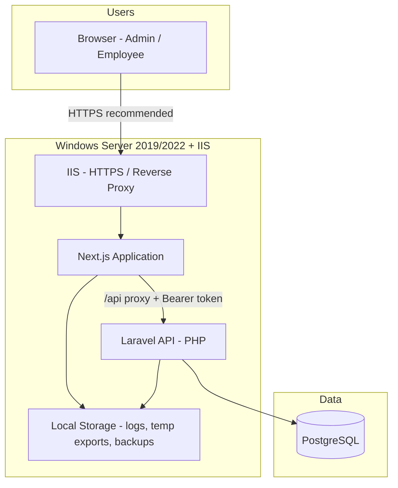

### 3.2 Deployment notes

- **IIS** is the public entry point; SSL/TLS is **strongly recommended** because payroll data includes salary, bank, PAN, and Aadhaar.
- **Next.js** serves the React UI and proxies authenticated API calls to Laravel.
- **Laravel** is stateless; enforces RBAC, calculations, and data integrity.
- **PostgreSQL** is the authoritative data store.
- **Payslips and reports** are generated at request time and streamed to the browser — not stored on network-attached storage by default.
- **Same-server storage** is sufficient for application files, database (or DB on separate VM), logs, temporary import buffers, and backup files.

### 3.3 Typical request flow

```
Browser → IIS → Next.js page or /api/* proxy → Laravel /api/v1/* → PostgreSQL
```

---

## 4. Single Institute Architecture

CIRT Payroll operates as a **fixed single-institute** system.

| Concept | Implementation |
|---------|----------------|
| Institute profile | `cirt_institute` table (renamed from legacy `cirt_companies`) |
| Internal scoping | `company_id` column on child tables — **always the CIRT institute UUID** |
| User experience | No institute selector, no create/switch/rename in UI |
| Import / export | No Company ID column; all rows auto-scoped to CIRT |
| API security | `company_id` from request body is **not trusted**; resolved from authenticated user context |

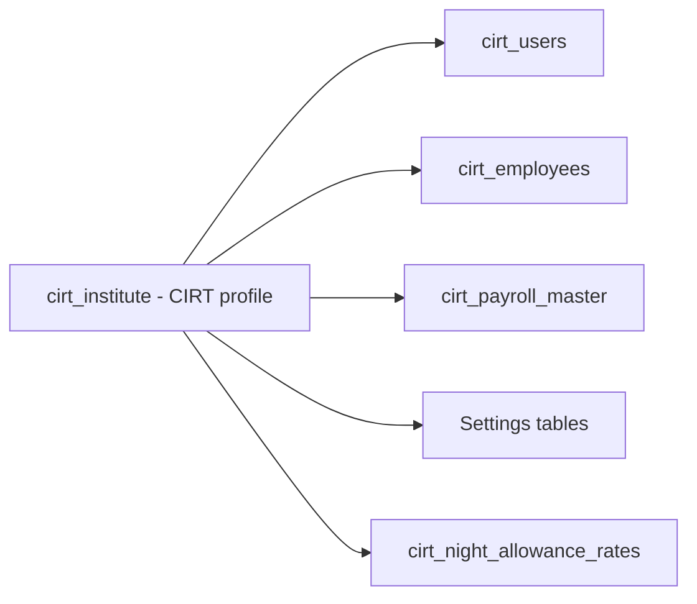

The institute row holds defaults: DA %, HRA %, professional tax, logo, address, and related configuration.

---

## 5. Application Modules

### 5.1 Module map

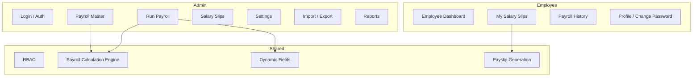

### 5.2 Admin modules

| Module | Route (UI) | Backend |
|--------|------------|---------|
| Login / Auth | `/auth/login` | `AuthController`, Sanctum |
| Payroll Master | `/payroll/master` | `PayrollMasterController`, `PayrollMasterService` |
| Run Payroll | `/payroll` (run tab) | `PayrollController` |
| Salary Slips | `/payroll` (slips tab) | `PayslipController` |
| Settings | `/settings` | Company, org, fields, quarters, NDA, CPF |
| Institute Profile | Settings → Institute | `CompanyController` |
| Roles | Settings → Roles | `RoleController` |
| Divisions & Departments | Settings | Division/Department controllers |
| Designations | Settings | `DesignationController` |
| Salary Increment | Settings → Salary Increment | `SalaryIncrementController` |
| Payroll Fields | Settings → Payroll Fields | `PayrollFieldController` |
| Quarters | Settings → Quarters | `QuarterController` |
| Night Allowance (NDA) | Settings → Night Allowance | `NightAllowanceRateController` |
| Import Payroll Master | Payroll Master → Import | `PayrollMasterService` |
| Export Payroll Master / Run | Export actions | Excel stream endpoints |
| Reports | Payroll / export views | On-demand generation |

### 5.3 Employee modules

| Module | Route | Access |
|--------|-------|--------|
| Employee Dashboard | `/employee/dashboard` | Own summary, latest payroll |
| My Salary Slips | Payslip views | Own records only |
| Payroll History | `/employee/payroll-history` | Own monthly payroll history |
| Profile | `/profile` | Read / limited update |
| Change Password | Profile | Self only |

Employees **cannot** edit payroll master data or access admin APIs.

### 5.4 Shared services

- Role-based access control (Admin vs Employee)
- Self-only access enforcement (`CompanyAccess`)
- Government payroll calculation engine (frontend preview + backend validation)
- Dynamic payroll field resolution
- Import validation and formula-injection sanitization
- Sensitive field masking (PAN, Aadhaar, bank)

---

## 6. Database Entity Overview

PostgreSQL stores all payroll, employee, configuration, and history data. The internal `company_id` on each table references `cirt_institute.id`.

| Table | Purpose | Primary module | Snapshot behaviour |
|-------|---------|----------------|-------------------|
| `cirt_institute` | Fixed CIRT org profile, DA/HRA/PT defaults | Settings | Single row |
| `cirt_users` | Login accounts | Auth | Current |
| `cirt_roles` | Role catalog | Settings | Reference |
| `cirt_employees` | HR employee records | Employees | Current |
| `cirt_employee_bank_accounts` | Bank account history | Payroll Master | Historical versions |
| `cirt_divisions` | Org divisions | Settings | Reference |
| `cirt_departments` | Departments (linked to division) | Settings | Reference |
| `cirt_designations` | Job titles | Settings | Reference |
| `cirt_payroll_master` | Current employee salary structure | Payroll Master | Effective-dated current row |
| `cirt_payroll_master_history` | Archived payroll master revisions | Payroll Master | Immutable history |
| `cirt_payroll_periods` | Month/year payroll run container | Run Payroll | One per period |
| `cirt_monthly_payroll` | Per-employee monthly payroll snapshot | Run Payroll | **Frozen at finalize** |
| `cirt_payslips` | Payslip header linked to monthly payroll | Salary Slips | Snapshot |
| `cirt_payroll_field_definitions` | Configurable custom fields | Settings | Active definitions |
| `cirt_payroll_field_values` | Custom field values (master + monthly) | Payroll Master / Run Payroll | Master + monthly copies |
| `cirt_payroll_calculation_settings` | CPF mode, basis, electricity rate, NDA ceiling | Settings | Institute-wide |
| `cirt_salary_increments` | Applied increment history | Salary Increment | Audit trail |
| `cirt_quarters` | Quarter master (rent, type, assignment) | Settings → Quarters | Current |
| `cirt_quarter_assignments` | Quarter assignment history | Quarters | Historical |
| `cirt_da_revision_events` | Institute DA revision events | Settings / Arrears | Immutable |
| `cirt_payroll_arrear_batches` | Arrear run batch per DA revision | Run Payroll | Per revision + period |
| `cirt_payroll_arrear_lines` | Per-employee arrear lines | Run Payroll | Locked when included |
| `cirt_night_allowance_rates` | NDA hourly rate master by pay level | Settings → Night Allowance | Effective-dated rates |
| `personal_access_tokens` | Sanctum API tokens | Auth | Revocable |
| `migrations` | Laravel migration log | System | — |

---

## 7. ER Diagram

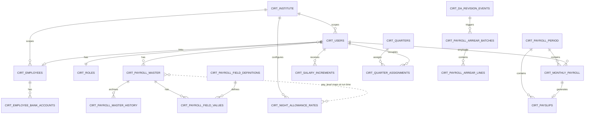

**NDA mapping** is logical (not a foreign key): at Run Payroll, `employee.pay_level` resolves to an active row in `cirt_night_allowance_rates` for the same institute.

---

## 8. Payroll Master Architecture

### 8.1 Purpose

Payroll Master is the authoritative **employee salary structure** used by Run Payroll. Administrators create, edit, import, and revise employee records.

### 8.2 Core fields

| Area | Fields |
|------|--------|
| Identity | Employee code, name, email, phone, gender, dates |
| Organization | Designation, department, division |
| Pay structure | **Pay Level** (7th CPC Level 1–18), increment month (January / July), gross basic, DA %, HRA %, medical |
| Statutory | UAN, CPF number, PAN, Aadhaar |
| Bank | Bank name, account number, IFSC |
| Quarter | Quarter assigned flag, quarter, rent |
| CPF override | Use institute settings or employee custom (percentage / fixed, basis fields) |
| Dynamic fields | Configured in Settings → Payroll Fields |

### 8.3 Pay Level and Night Duty Allowance

- **Pay Level** is selected from a dropdown (7th CPC Level 1–18).
- **Night allowance slab is not selected** in the employee form.
- At Run Payroll, **Night Duty Allowance (NDA) rate is resolved automatically** from `cirt_night_allowance_rates` using the employee's pay level.
- Legacy column `night_allowance_slab_no` on payroll master may exist but is **not used** in the UI; resolved slab is stored on monthly payroll for audit only.

### 8.4 Revision history

Salary structure changes create rows in `cirt_payroll_master_history`. The current open row in `cirt_payroll_master` has `effective_end_date` null. Run Payroll resolves the master effective for the payroll date.

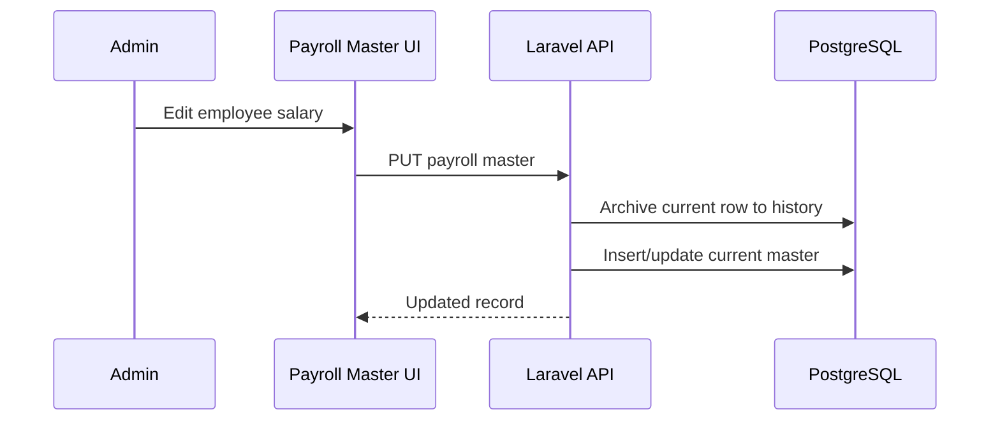

---

## 9. Dynamic Payroll Fields Architecture

Administrators define additional payroll fields under **Settings → Payroll Fields**.

### 9.1 Field groups

| Group | Examples |
|-------|----------|
| Basic Details | Custom identifiers |
| Earnings | Allowances, reimbursements |
| Statutory | Additional statutory values |
| Deductions | Loan, advance heads |
| Bank Details | Supplementary bank fields |

### 9.2 Visibility flags

Each field can appear in:

- Payroll Master form
- Run Payroll preview
- Salary Slip
- Import template
- Export

Fields may be included in **total earnings** or **total deductions** calculations.

### 9.3 Storage

| Table | Role |
|-------|------|
| `cirt_payroll_field_definitions` | Field metadata, type, group, flags |
| `cirt_payroll_field_values` | Values keyed to `payroll_master_id` and/or `payroll_period_id` |

**Snapshot rule:** Monthly payroll stores `custom_earnings` and `custom_deductions` JSON on `cirt_monthly_payroll` so past months remain stable if field definitions change later.

---

## 10. CPF/PF Calculation Architecture

### 10.1 Institute default

Configured in **Settings → Payroll Configuration**:

| Setting | Options |
|---------|---------|
| Calculation mode | Percentage or fixed amount |
| CPF percentage | e.g. 12% |
| Basis field keys | Basic, DA, HRA, Medical, Transport, custom earnings |
| Fixed amount | Used when mode = fixed (ignores percentage/basis) |

### 10.2 Employee override

Per employee in Payroll Master:

| Flag | Behaviour |
|------|-----------|
| Use institute settings | Default CPF from institute configuration |
| Custom override | Employee-specific percentage, fixed amount, or basis fields |

### 10.3 Run Payroll snapshot

Monthly payroll persists:

- `cpf_calculation_mode`
- `cpf_fixed_amount` (if applicable)
- CPF basis and computed CPF amount
- Backend **re-validates and recalculates** — not frontend-only

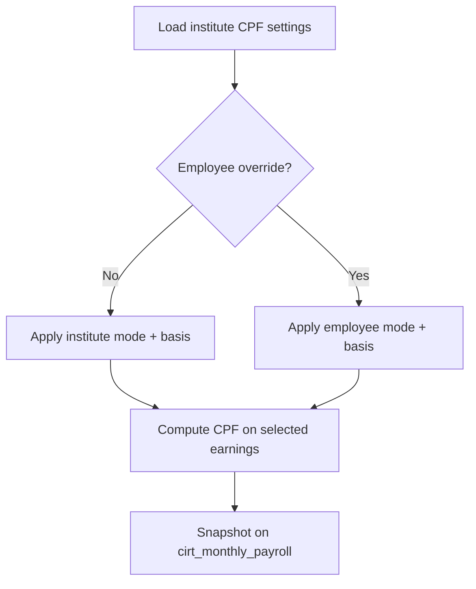

---

## 11. Run Payroll Architecture

### 11.1 Flow

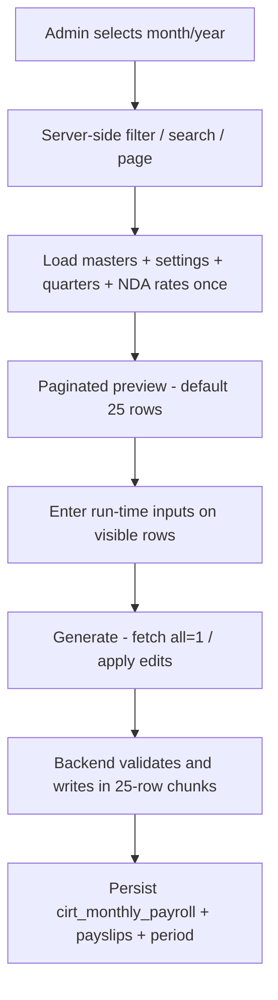

### 11.2 Performance behaviour

| Concern | Behaviour |
|---------|-----------|
| Preview page size | Default **25**; options 25 / 50 / 100 (`ApiPagination`, max 100) |
| Search / filters | Server-side: search, division, department; 300ms debounce on UI |
| Page load | Calculates **visible page only**; does not generate all employees until Confirm |
| Generate All | Uses `?all=1` (or equivalent full payload); merges per-row UI edits from client cache |
| Confirm writes | Sorted by `employee_user_id`; **25-employee DB transactions** to reduce lock duration |
| Preloads | NDA rates, payroll config, custom field values loaded **once per request** (no N+1) |
| Duplicate monthly row | Unique index `(payroll_period_id, employee_user_id)` prevents double run |

### 11.3 Run-time inputs (per employee)

| Input | Purpose |
|-------|---------|
| Paid days | Pro-rata earnings |
| HPL / EOL days | Leave deductions (run-time only — not stored on payroll master) |
| Reference month/year | EOL/HPL salary basis from prior month snapshot |
| Night hours | Night Duty Allowance |
| Electricity units | Electricity deduction |
| Reimbursements / advances | Variable earnings/deductions |
| Quarter rent override | Monthly quarter rent adjustment |

### 11.4 Core formulas

| Component | Formula |
|-----------|---------|
| DA | Basic × DA% |
| HRA | Basic × HRA% **unless quarter assigned → HRA = 0** |
| Transport | Pay-level slab + transport DA |
| Total Earnings | Sum of configured earning lines (incl. NDA, custom) |
| Total Deductions | Sum of configured deduction lines |
| Net Pay | Total Earnings − Total Deductions |

---

## 12. EOL/HPL Deduction Architecture

Leave deductions are **run-time inputs on Run Payroll only**. They are **not** stored as defaults on `cirt_payroll_master` (those columns were removed after an interim migration).

Implementation: `src/lib/hplEolDeductions.ts` + `src/lib/governmentPayroll.ts` (backend unit tests mirror the same rules).

### 12.1 Separate bases (critical)

| Leave type | Deduction / earnings basis | Components reduced (current-month leave) |
|------------|----------------------------|------------------------------------------|
| **EOL** | Basic + DA + **HRA** + **Medical** | Basic, DA, HRA, Medical (proportional) |
| **HPL** | Basic + DA **only** | Basic and DA only — **HRA and Medical unchanged** |

Transport and other allowances are **excluded** from both bases.

**HPL day factor:** `HPL_DAY_SALARY_FACTOR = 0.5` (two HPL days ≈ one day of Basic+DA salary).

```
EOL daily basis  = (Basic + DA + HRA + Medical) / days_in_reference_month
HPL daily basis  = (Basic + DA) / days_in_reference_month
EOL deduction    = round(EOL daily × eol_days)
HPL deduction    = round(HPL daily × hpl_days × 0.5)
```

When leave is for the **current** payroll month (not a prior-month reference), paid earnings are reduced via:

- EOL → `applyProportionalEarningsCut` (basic / da / hra / medical)
- HPL → `applyBasicDaEarningsCut` (basic / da only; hra & medical preserved)

Prior-month leave appears as a **deduction line** using the reference snapshot and does not rewrite current paid HRA/medical incorrectly for HPL.

### 12.2 Reference month logic

Leave deductions may relate to a **previous month** (e.g. running July payroll but deducting June EOL).

| Step | Behaviour |
|------|-----------|
| 1 | Admin selects EOL/HPL reference month and year |
| 2 | System looks up **stored monthly payroll** for that reference period |
| 3 | If found | Uses snapshot salary for basis calculation |
| 4 | If not found | Falls back to current payroll master with **warning** |

### 12.3 Monthly snapshot columns

| Column | Description |
|--------|-------------|
| `hpl_days` / `eol_days` | Days entered at run time |
| `hpl_reference_month` / `hpl_reference_year` | Reference period |
| `eol_reference_month` / `eol_reference_year` | Reference period |
| `hpl_basis_amount` / `eol_basis_amount` | Computed basis (HPL = Basic+DA; EOL = Basic+DA+HRA+Medical) |
| `hpl_amount` / `eol_amount` | Deduction amounts |

---

## 13. Quarters / Accommodation Architecture

### 13.1 Quarter master (`cirt_quarters`)

| Field | Description |
|-------|-------------|
| Quarter name/number | Unique per institute |
| Quarter type | e.g. Type A, B, C |
| Monthly rent | Default rent |
| Status | Available / occupied |
| Assigned employee | Current assignee |

### 13.2 Payroll impact

| Condition | Effect |
|-----------|--------|
| Employee has quarter | **HRA = 0** |
| Quarter assigned | **Quarter rent deduction** applies |
| Run Payroll | Rent default from quarter master; **editable override** per month |
| Salary Slip | Shows HRA 0 and quarter rent line |

Assignment history is stored in `cirt_quarter_assignments`.

---

## 14. Electricity Deduction Architecture

| Setting / input | Location |
|-----------------|----------|
| Electricity unit rate | Settings → Payroll Configuration |
| Units consumed | Run Payroll (per employee) |

**Formula:**

```
Electricity Deduction = Units Consumed × Unit Rate
```

Admin may override the computed amount. Monthly snapshot:

| Column | Description |
|--------|-------------|
| `electricity_units_consumed` | Units entered |
| `electricity_unit_rate` | Rate applied |
| `electricity` / deduction amount | Final deduction |
| `electricity_manual_override` | Override flag |

---

## 15. Night Duty Allowance (NDA) Architecture

### 15.1 Overview

Night Duty Allowance compensates employees for night duty hours at an **hourly rate** determined by their **7th CPC Pay Level**. Rates are managed in **Settings → Night Allowance** — not per employee.

### 15.2 Rate master (`cirt_night_allowance_rates`)

| Column | Description |
|--------|-------------|
| `slab_no` | Unique serial number per institute (S.No) |
| `pay_level` | 7th CPC pay level |
| `rate_per_hour` | Hourly allowance rate (₹) |
| `effective_from` | Optional effective date |
| `is_active` | Active / inactive |

**Rules:**

- `slab_no` must be **unique** per institute.
- Multiple rows may share the same `pay_level` (official table has duplicate levels for 5, 6, 8).
- Employee form does **not** select a slab — mapping is automatic at Run Payroll.

### 15.3 Rate resolution at Run Payroll

```
employee.pay_level → active NDA rate(s) for institute
  → filter: is_active = true
  → filter: effective_from ≤ payroll period end (if set)
  → order: effective_from DESC (nulls last), slab_no ASC
  → pick first row
```

If no rate is configured: **rate = 0** with warning *"Night allowance rate is not configured for this Pay Level."*

At scale, Run Payroll loads all active NDA rates once and resolves via `NightAllowanceRateService::resolveFromPreloadedRates` (avoids per-employee queries). Frontend mirror: `src/lib/nightAllowanceCalculation.ts`.

### 15.4 Default seed data (S.No / Pay Level / Rate per hour)

| S.No | Pay Level | Rate / Hour (₹) |
|------|-----------|-----------------|
| 1 | Level 1 | 23.20 |
| 2 | Level 2 | 26.10 |
| 3 | Level 3 | 28.85 |
| 4 | Level 4 | 32.65 |
| 5 | Level 5 | 36.55 |
| 6 | Level 5 | 38.05 |
| 7 | Level 5 | 39.60 |
| 8 | Level 5 | 41.25 |
| 9 | Level 6 | 43.50 |
| 10 | Level 6 | 46.00 |
| 11 | Level 7 | 50.40 |
| 12 | Level 8 | 55.45 |
| 13 | Level 8 | 58.55 |
| 14 | Level 9 | 63.60 |

> **Note:** Default seed covers Pay Levels 1–9. Employees on Pay Levels 10–18 require rates to be added in Settings if NDA applies.

### 15.5 Calculation

```
Night Allowance = Night Hours × Rate Per Hour
```

### 15.6 Basic pay eligibility ceiling

| Rule | Value |
|------|-------|
| Default ceiling | ₹43,600 per month (configurable in Settings) |
| If Basic Pay **>** ceiling | NDA = **0** (not eligible) |
| If Basic Pay **≤** ceiling | NDA calculates normally |

**Examples:**

| Basic Pay | Night Hours | Rate | NDA |
|-----------|-------------|------|-----|
| ₹36,400 | 10 | ₹50.40 | **₹504** |
| ₹49,440 | 10 | ₹50.40 | **₹0** (exceeds ceiling) |

### 15.7 Monthly snapshot columns

| Column | Description |
|--------|-------------|
| `night_hours` | Hours worked |
| `night_allowance_rate` | Resolved hourly rate |
| `night_allowance_amount` | Computed amount |
| `night_allowance_slab_no` | Resolved slab (audit) |
| `night_allowance_basic_ceiling` | Ceiling applied |
| `night_allowance_eligible` | Eligibility flag |
| `night_allowance_manual_override` | Manual override flag (if used) |

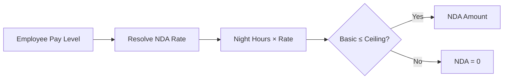

---

## 16. Salary Increment Architecture

| Element | Description |
|---------|-------------|
| Increment month | Payroll Master field: **January** or **July** |
| Settings action | Admin selects cycle, year, effective date, percentage |
| Eligibility | Employees matching selected increment month |
| Effect | New gross basic = old basic + increment % |
| History | `cirt_salary_increments` stores old/new basic, %, effective date |
| Past payroll | Unchanged — snapshots remain as originally calculated |

---

## 17. DA Revision and Arrears Architecture

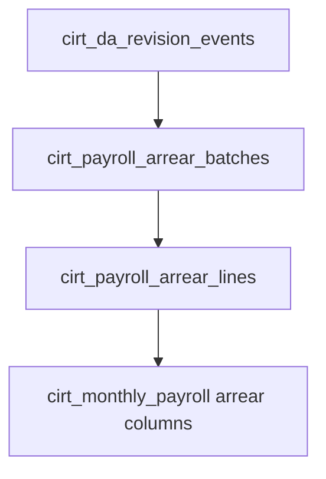

| Stage | Table | Content |
|-------|-------|---------|
| DA revision recorded | `cirt_da_revision_events` | Old/new DA %, effective from |
| Batch created | `cirt_payroll_arrear_batches` | Arrear period, totals |
| Per employee | `cirt_payroll_arrear_lines` | DA, transport, gross, CPF, net arrear |
| Included in run | `cirt_monthly_payroll` | `da_arrear`, `transport_arrear`, `gross_arrear`, `cpf_arrear`, `net_arrear` |

Arrear block appears on Run Payroll preview and Salary Slip (including zero arrears for consistency).

---

## 18. Salary Slip Architecture

- Generated from **monthly payroll snapshot** — not live master recalculation.
- **Admin:** view/download any employee slip for a finalized period.
- **Employee:** view/download **own** slips only.
- **No blank employee** pre-selected on initial load.

### 18.1 Slip contents

| Section | Items |
|---------|-------|
| Header | CIRT institute, employee, period |
| Earnings | Basic, DA, HRA, medical, transport, NDA, custom |
| Deductions | CPF, PT, quarter rent, electricity, EOL/HPL, custom |
| Arrears | DA, transport, gross, CPF, net |
| Summary | Total earnings, total deductions, net pay |
| Dynamic fields | Per field configuration |

Output: screen preview, browser print/PDF, Excel export — **on demand**.

---

## 19. Employee Self-Service Architecture

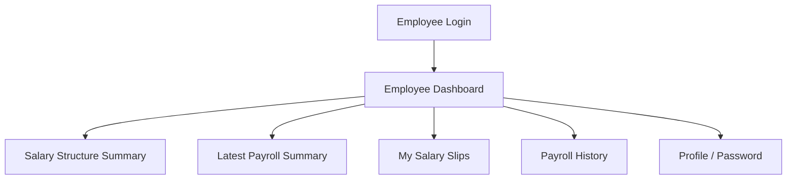

| Rule | Enforcement |
|------|-------------|
| Own data only | `employee_user_id` must match logged-in user |
| No admin pages | Route and API middleware block admin paths |
| Read-only payroll | Employee cannot edit salary structure |
| Masked sensitive fields | PAN/Aadhaar masked in API responses |

---

## 20. Import/Export Architecture

### 20.1 Payroll Master import

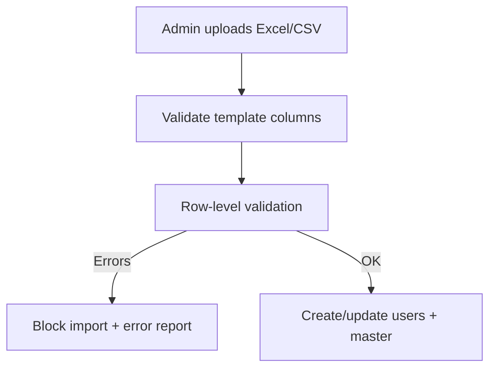

**Validations include:**

| Check | Rule |
|-------|------|
| Required fields | Employee code, name, email, pay level, PAN, Aadhaar, bank account, gross basic, increment month |
| Pay Level | 7th CPC Level 1–18 (accepts `7` or `Level 7`) |
| Uniqueness | Employee code, email, phone, PAN, Aadhaar, bank account — via **batch index** (`buildImportUniquenessIndex`), not per-row full-table scans |
| PAN / Aadhaar | Format and length |
| Dynamic fields | Type validation per field definition |
| Quarter fields | Valid quarter reference when assigned |
| Security | Formula injection neutralization; no `company_id` in template; max upload size enforced |

Import **blocks the full file** if any row has errors. Valid rows save in a **transaction** with chunked inserts/updates (~50 rows).

### 20.2 Export

| Export | Behaviour |
|--------|-----------|
| Payroll Master | Dynamic fields; no `company_id`; `?all=1` for full list; **Exporting…** state while running |
| Run Payroll | NDA / quarter / electricity; month-year scoped; no duplicate PT/Net Pay columns |
| Reports | Filtered by month/employee; empty state when no data |

---

## 21. Reports and Export Architecture

| Report type | Source | Format |
|-------------|--------|--------|
| Month-wise payroll | `cirt_monthly_payroll` | Excel/CSV |
| Employee payroll history | Monthly payroll + payslips | Excel / UI table |
| Salary slip | Monthly snapshot | Print / PDF / Excel |

Exports use rounded rupee amounts consistent with payroll engine. Dynamic and NDA columns included when configured/used.

---

## 22. Security Architecture

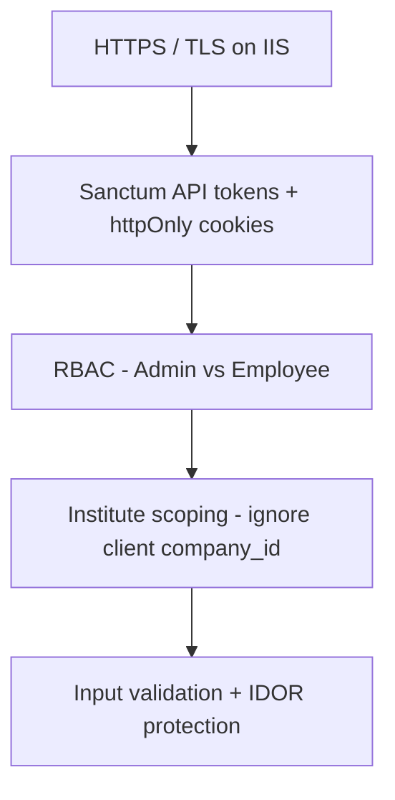

| Control | Implementation |
|---------|----------------|
| Public signup | Disabled (`allow_public_signup` → API 403) |
| Admin routes | Middleware: managerial role required |
| Employee self-access | `CompanyAccess` — own `employee_user_id` only |
| Token storage | Sanctum token in **httpOnly cookie** — not localStorage for auth |
| localStorage | Non-auth UI only (payroll-master draft, sidebar); legacy auth key cleared |
| Sensitive data | Masking on PAN, Aadhaar, bank in responses |
| Import files | Type/size validation; formula injection sanitization |
| Export | Authorization check before stream |
| Payroll tampering | Backend recalculates before persist |
| Production | `APP_DEBUG=false`; friendly API errors; no secrets/PAN/Aadhaar/bank in logs |

---

## 23. Loading, Pagination, and UX Architecture

| Concern | Behaviour |
|---------|-----------|
| Loaders | Shared loader on admin and employee pages |
| Placeholders | No blank dash cards before data loads |
| Pagination | Default **25**; options **25 / 50 / 100**; `PaginationControls` |
| Search | Debounced **300ms**; server-side on Payroll Master and Run Payroll |
| Filters change | Reset to page 1 |
| Import / export | Loading / disabled states prevent double-submit |
| List API shape | `{ data, meta: { current_page, per_page, total, last_page } }` |
| Full lists | Explicit `?all=1` for export / generate only |

---

## 23A. Performance and Scalability Architecture

Target: ~**120 employees**, multi-year history.

| Area | Implementation |
|------|----------------|
| Pagination helper | `ApiPagination` — default 25, max 100 |
| Payroll Master | Server-paginated list + debounced search |
| Run Payroll | Paginated preview; generate uses full set; confirm in **25-row chunks** |
| Import uniqueness | Preloaded uniqueness maps (no N+1) |
| Indexes | `2026_07_25_100000_performance_indexes.php` |
| Duplicate monthly payroll | Unique `(payroll_period_id, employee_user_id)` |
| Deadlock mitigation | Sorted `employee_user_id`; short transactions |
| Checklist | [PRE_DEPLOYMENT_PERFORMANCE_CHECKLIST.md](./PRE_DEPLOYMENT_PERFORMANCE_CHECKLIST.md) |

---

## 24. Backup and Storage Considerations

| Topic | Approach |
|-------|----------|
| Document storage | No heavy upload module; payslips exported on demand |
| NAS | **Not required** for routine operation |
| Server storage | App binaries, logs, temp import buffers, optional export cache |
| **Primary backup** | **PostgreSQL** regular backups (master, monthly payroll, history, arrears, settings) |
| SSL | Recommended for all production access |

---

## 25. Detailed Table Appendix

See **[CIRT_PAYROLL_DATABASE_ARCHITECTURE.md](./CIRT_PAYROLL_DATABASE_ARCHITECTURE.md)** for column-level definitions, primary keys, foreign keys, and indexes.

---

## 26. Manual Verification Checklist

| # | Test | Expected |
|---|------|----------|
| 1 | Admin login at `/auth/login` | Access to Payroll Master, Run Payroll, Settings |
| 2 | Employee login | Redirect to employee dashboard only |
| 3 | Payroll Master add/edit | Pay Level dropdown; no NDA slab selection |
| 4 | Payroll Master pagination | Default 25 rows; search debounced server-side |
| 5 | Dynamic field add | Appears in master, run payroll, slip per flags |
| 6 | CPF percentage / fixed | Mode behaves per settings |
| 7 | Run Payroll paginated preview | Does not calculate all employees on page load |
| 8 | Generate / Confirm | Chunked writes; no duplicate monthly rows |
| 9 | EOL current-month leave | Reduces Basic, DA, HRA, Medical |
| 10 | HPL current-month leave | Reduces **Basic + DA only**; HRA & Medical unchanged |
| 11 | EOL/HPL reference month | Prior month salary used when available |
| 12 | Quarter assigned | HRA = 0; quarter rent deducted |
| 13 | Electricity units | Units × rate deducted |
| 14 | NDA — eligible basic | Hours × rate applied |
| 15 | NDA — basic above ceiling | NDA = 0; warning shown |
| 16 | Salary slip | Matches monthly snapshot |
| 17 | Import invalid pay level | Row error; import blocked |
| 18 | Export run payroll | NDA, quarter, electricity columns present |
| 19 | Employee dashboard | Own slips only; no admin access |
| 20 | Security / production | Token required; `APP_DEBUG=false`; migrate indexes |

---

## Glossary

| Term | Meaning |
|------|---------|
| **CIRT Institute** | Sole organization (`cirt_institute`); user-facing name for the fixed org |
| **company_id** | Internal database FK to institute; hidden from UI and exports |
| **Payroll Master** | Employee salary structure template |
| **Run Payroll** | Monthly calculation and persistence |
| **NDA** | Night Duty Allowance — hourly night duty compensation |
| **EOL** | Extraordinary Leave — basis Basic+DA+HRA+Medical |
| **HPL** | Half Pay Leave — basis Basic+DA only (factor 0.5 per day) |
| **7th CPC Pay Level** | Government pay matrix level (1–18 in this system) |

---

*This document describes the production-intended architecture of CIRT Payroll as implemented in July 2026 (performance hardening + HPL/EOL basis correction). Database table names reflect the current PostgreSQL schema.*
